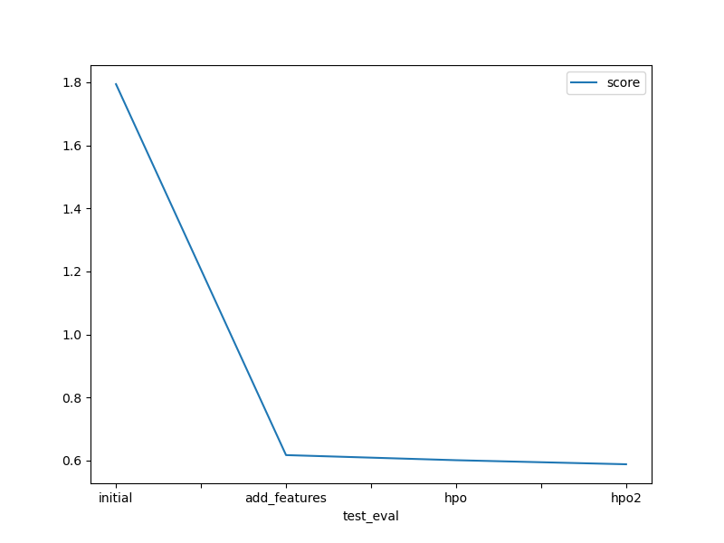

# Report: Predict Bike Sharing Demand with AutoGluon Solution
MUHAMMAD UMAR FARRUKH

## Initial Training
### What did you realize when you tried to submit your predictions? What changes were needed to the output of the predictor to submit your results?
All the predictions need to having value more than zero as it is Kaggles criteria that it will reject submissions with values in negative so all the values less than zero were converted to zero using loop, this was my first submission to kaggle using CLI so the learnings aboout converting them too zero before zero was helpful, in iteration 2 you can see two of my submissions have errors in them where negative values in predictions were submitted so it was rejected by kaggle so cconverting them to zero helped to submit it succewssfully 

### What was the top ranked model that performed?
Top Ranked model had score of 0.58 which is the last one, in this last iteration i checked for correlation among features and found weather to be correlated with humidity along with season correlated with month so i one hot encooded these features, similarly in hyper paramters reducing number of leaves and increasing number of epochs increased the efficency

## Exploratory data analysis and feature creation
### What did the exploratory analysis find and how did you add additional features?
In EDA i found some features did not had the correct data type such as weather and season, so there data type was corrected along with datetime feature converted into datetime using pandas function, also the date time original feature was dropped and new feature of day, month, year and hour were created

### How much better did your model preform after adding additional features and why do you think that is?
Having more nominal features and correct data types increased the perfoormance of model as features with incorrect data type can be inferred incorrectly by the model 

## Hyper parameter tuning
### How much better did your model preform after trying different hyper parameters?
the root mean squared error for the model decreased which improved the score for kaggle submission , having more tuning of hyper paramters can help increase score of submission

### If you were given more time with this dataset, where do you think you would spend more time?
i would have implemented time series modelling along with more tuning of the hyper paramters as there is a range of hyper pramters associated for time series which can be used and that can imrprove the learning 

### Create a table with the models you ran, the hyperparameters modified, and the kaggle score.
|model|hpo1|hpo2|hpo3|score|
|--|--|--|--|--|
|initial|53.012271|53.012271|43.518283|1.79413|
|add_features|34.804929|34.804929|34.804929|0.61719|
|hpo|43.518283|43.518283|43.518283|0.60101|
|hpo2|40.121809|40.266762|41.335800|0.58809

### Create a line plot showing the top model score for the three (or more) training runs during the project.

### Create a line plot showing the top kaggle score for the three (or more) prediction submissions during the project.

## Summary
TODO: Add your explanation
